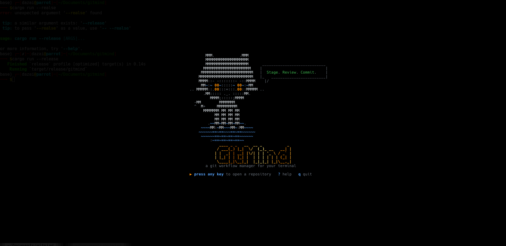
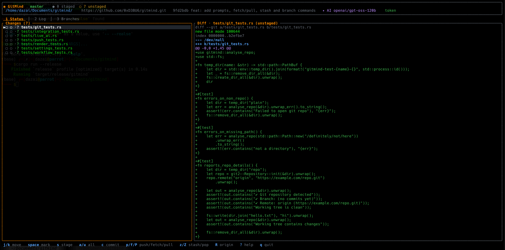

# GitMind

A terminal UI for everyday git work: browse status, diffs, log and branches,
stage and commit, let an LLM draft the commit message from the staged diff,
and push to GitHub. Built with Rust, [ratatui] and [git2], with LLM access
through [rig-core]. Any OpenAI-compatible provider key works; the default endpoint is Groq.

```
cargo run --release              # splash → path prompt
cargo run --release -- ~/repo    # open a repo directly
```

## Demo

| Splash | Dashboard |
|--------|-----------|
|  |  |

## Bring your own keys

Press `,` on any screen (or `Ctrl-S` on the path prompt) to open settings.
The key is also shown in every footer and on the splash screen. Values are saved to
`~/.config/gitmind/config.toml` with mode 600 and never leave your machine
except in requests to the provider you configured.

| Field         | Where to get it                                  | Env override    |
|---------------|--------------------------------------------------|-----------------|
| LLM API key   | from your LLM provider (e.g. console.groq.com/keys) | `LLM_API_KEY` |
| Model         | model id at the provider (default `openai/gpt-oss-120b`) | –       |
| GitHub token  | filled in by **Login with GitHub**, or paste a PAT (`repo` scope) | `GITHUB_TOKEN` |

SSH remotes (`git@github.com:...`) use your running SSH agent instead of the
token. HTTPS remotes use the token, falling back to git's credential helper.

## Workflow

1. On the Status tab, `space` marks files, `v` marks all, `x` clears marks.
   `s` stages (or unstages) everything marked in one go, or just the
   highlighted file if nothing is marked. `a` / `u` stage / unstage all.
2. `c` opens the commit popup. If an LLM API key is set the model drafts a
   message from the staged diff; edit it freely, `^G` to regenerate.
3. `Enter` commits, `^P` commits and pushes.
4. `p` pushes the current branch to `origin` any time.

### More git workflow

| Key | Action |
|-----|--------|
| `R` | add `origin` or change its URL |
| `f` / `P` | fetch origin / pull (fast-forward only; diverged branches are refused) |
| `n` | new branch at HEAD, checked out |
| `D` | delete the highlighted branch (Branches tab; type its name to confirm) |
| `z` / `Z` | stash working tree (incl. untracked) / pop the latest stash |
| `Ctrl-I` | on the path prompt: `git init` a plain folder and open it |

`?` shows the full key map.

[ratatui]: https://ratatui.rs
[git2]: https://docs.rs/git2
[rig-core]: https://docs.rs/rig-core
